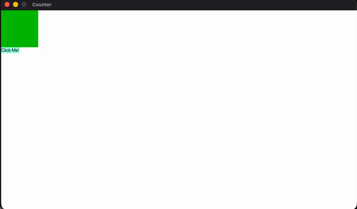

# Sen
Sen is a unique UI framework, built with the 
[Verdant rendering library](https://github.com/grimtin10/verdant), which
focuses on being declarative with good defaults.



**Sen is not yet at a usable version**

# Usage
Feel free to go to the ``examples/`` directory to see all the examples I've
put together, however here is a basic counter program.

```rs
fn main() -> Result<(), Error> {
    let mut renderer = Renderer::new().unwrap();
    let window = renderer.create_window("Counter", 1920, 1080);
    let mut swin = SenWindow::new(window, Vec2::new(1920., 1080.));
    swin.force_thread_timeout = Some(Duration::from_secs(1) / 60);

    swin.start(&mut renderer, &mut App().as_view());

    Ok(())
}

#[allow(non_snake_case)]
fn App() -> impl Component {
    let font = Font::load("/System/Library/Fonts/SFNS.ttf").unwrap();
    let s = State::new(0);
    Div::new(Many::new(vec![
        s.with(move |val| {
            sen::components::text::Text::new(val.to_string(), font.clone())
                .text_size(25.)
                .padding(Padding::Top { t: 20. })
                .as_view()
        }).as_view(),
        Div::new(
            Button("Click Me!", enclose!([s] move || {
                let val = *s.get();
                _ = s.set(val + 1);
            }))
        ).margin(Margin::Top { t: 10. }).color(Color::TRANSPARENT).as_view(),
    ]).display(DisplayType::Flex(FlexDirection::Column))).color(Color::WHITE).size(Vec2::new(1920., 1080.))
}

#[allow(non_snake_case)]
fn Button(text: impl Into<String>, fun: impl Fn() + 'static) -> Arc<State<(String, Color)>> {
    let font = Font::load("/System/Library/Fonts/SFNS.ttf").unwrap();
    let state = State::new((text.into(), Color::WHITE));

    let f = Arc::new(fun);
    state.with(move |val| {
        let fclone = f.clone();
        Div::new(Many::new(vec![
            sen::components::text::Text::new(val.0.clone(), font.clone())
                .text_size(25.)
                .padding(Padding::uniform(10.))
                .as_view()
        ]))
        .on_click(move || fclone.as_ref()())
        .color(Color::AQUAMARINE)
        .align_self(AlignSelf::FLEX_START)
        .rounding(15.)
        .outline(Color::BLACK, 5.)
        .as_view()
    })
}
```

# Upcoming
There's much to do, however, here are some big things I would like to
get done with this library.

- [x] Remove hardcoded sizing from the window
- [ ] Replace window type with ``impl RenderSurface``
- [ ] Expand styling to cover all of taffy's abilities
- [ ] Add more stateful builtin components
- [ ] Fix styling so that taffy doesn't use so much memory
